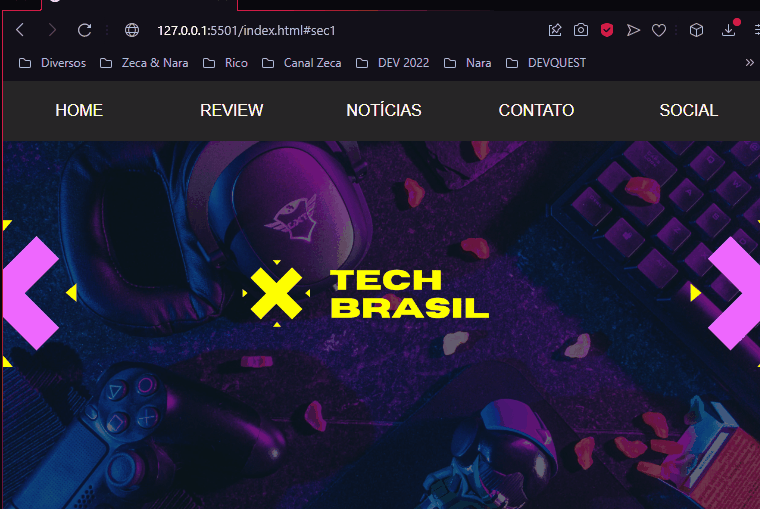

<h1 align="center">📰 Site Notícias 🖥️</h1>

A ideia do projeto nasceu com estudos em HTML, CSS e JS. Aos poucos o site está ganhado forma. Teremos o modelo de análises, notícias e contatos dos portais mais atuais do mercado.

 
 <h2>🕹️ Tecnologias Utilizadas</h2>
    <ul align="center">
        
        
    </ul> 

<h2 align="center">🤔 Como Utilizar </h2> 

É possível navegar pelo home, review, notícias e contatos. Abaixo temos um pequeno gif com a apresentação do site:

<i>Gif - Apresentação da página</i>
 

<h2 align="center">🔗 Link da página</h2>

Abaixo temos o link da página para visualização e testes:

🔗 <a href="https://oseiasweb.github.io/Site-Noticias/" target="_black">Site Notícias</a>  

 
<h2 align="center">🏆 Status Projeto</h2>

 

