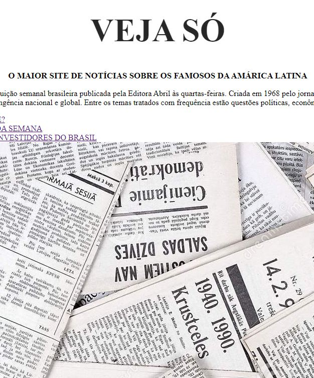

# Projeto Site de Notícias (HTML+CSS)
Esse é um projeto que aborda as técnicas Front End com o HTML, CSS e JS.
Em produção...🦾👨‍💻

[]

## Tecnologias Utilizadas
- HTML
- CSS

## Como Utilizar
Site de notícias e entretenimento. Navegação de páginas e exploração de links internos e externos. 